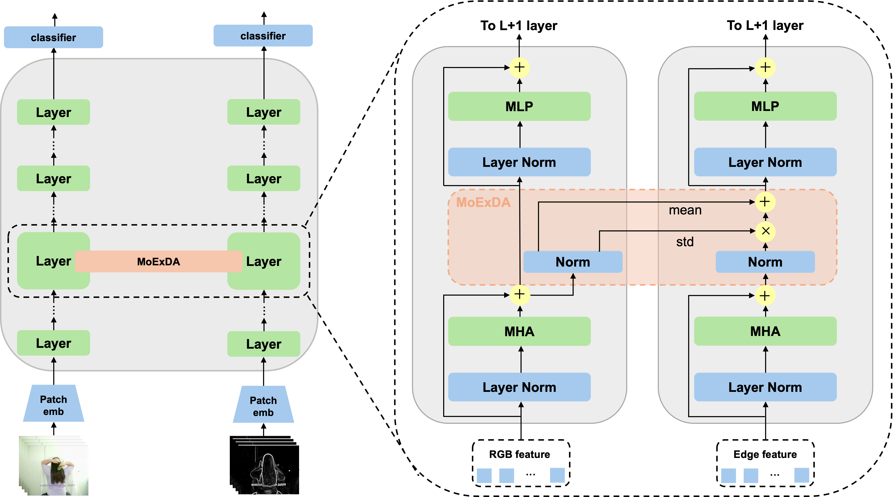

# MoExDA: Domain Adaptation for Edge-based Action Recognition

<p align="center">
  
</p>

This study proposes using edge detection to suppress static bias in action recognition tasks. However, introducing edge frames causes a domain shift with RGB information, leading to dropped recognition performance. To address this, we propose a lightweight domain adaptation method called MoExDA (Moment Exchange Domain Adaptation), which performs moment exchange within a Vision Transformer to bridge the gap between RGB and edge information, thereby mitigating performance degradation.

<!-- 本研究では、動作認識タスクにおける静的バイアスを抑制するためにエッジ検出の活用を提案します。しかし、エッジフレームを導入すると RGB 情報とのドメインシフトが生じ、そのままでは認識性能が低下してしまうという課題があります。そこで本研究では、Vision Transformer 内でモーメント交換（Moment Exchange）を行う軽量なドメイン適応手法「MoExDA」を提案し、RGB 情報とエッジ情報間のギャップを埋めることで、エッジ情報活用時の性能劣化を抑制します。 -->

## Installation

```bash
conda env create -f environment.yml
```

## Dataset Preparation

### Action Recognition Datasets

Use `make_shards.py` (inside the `make_shards` folder) to create dataset shards.
For more details, refer to [tamaki-lab/webdataset-video](https://github.com/tamaki-lab/webdataset-video).

<!-- shards の作成には`make_shards.py`（`make_shards`フォルダ内）を使用します。詳細は[tamaki-lab/webdataset-video](https://github.com/tamaki-lab/webdataset-video)を参照してください。 -->

#### UCF101

##### Training Shards

```bash
python3 make_shards/make_shards.py \
  -s ./2024_sugimoto_edge/datasets/UCF_shards_train \
  -d /path/to/your/raw_UCF101_train \
  -p UCF101 \
  -w 32 \
  --max_size_gb 1
```

##### Validation Shards

```bash
python3 make_shards/make_shards.py \
  -s ./2024_sugimoto_edge/datasets/UCF_shards_val \
  -d /path/to/your/raw_UCF101_val \
  -p UCF101 \
  -w 32 \
  --max_size_gb 1
```

#### HMDB51

##### Training Shards

```bash
python3 make_shards/make_shards.py \
  -s ./2024_sugimoto_edge/datasets/HMDB51_shards_train \
  -d /path/to/your/raw_HMDB51_train \
  -p HMDB51 \
  -w 32 \
  --max_size_gb 0.3
```

##### Validation Shards

```bash
python3 make_shards/make_shards.py \
  -s ./2024_sugimoto_edge/datasets/HMDB51_shards_val \
  -d /path/to/your/raw_HMDB51_val \
  -p HMDB51 \
  -w 32 \
  --max_size_gb 0.1
```

#### Kinetics50

We use a subset of Kinetics50 overwrapping only Mimetics classes.

<!-- Mimetics のクラスのみを抽出したサブセット`Kinetics50`を使用します。 -->

##### Training Shards

```bash
python3 make_shards/make_mimetics_shards.py \
  -s ./2024_sugimoto_edge/datasets/Kinetics50_shards \
  -d /path/to/your/raw_Kinetics400_train \
  -p Kinetics50 \
  -w 32 \
  --max_size_gb 10
```

##### Validation Shards

```bash
python3 make_shards/make_mimetics_shards.py \
  -s ./2024_sugimoto_edge/datasets/Kinetics50_shards \
  -d /path/to/your/raw_Kinetics400_val \
  -p Kinetics50 \
  -w 32 \
  --max_size_gb 1
```

After completion, organize the dataset into the following structure:

```bash
2024_sugimoto_edge/
├── datasets/
│   ├── UCF101_shards/
│   │   ├── train/
│   │   └── val/
│   ├── HMDB51_shards/
│   │   ├── train/
│   │   └── val/
│   └── Kinetics50_shards/
│       ├── train/
│       └── val/
```

## Usage

Refer to `./model/Moex_Video_Visiontransformer/moex_video_visiontransformer.py` for the model implementation.

<!-- モデルの実装は`./model/Moex_Video_Visiontransformer/moex_video_visiontransformer.py`を参照してください。 -->

```bash
usage: python main_pl.py [-h]
                        [--use_moex]
                        [--moex_layers ML [ML ...]]
                        [--norm_type {in,pono}]
                        [--position_moex {BeforeMHA,AfterMHA,BeforeMLP,AfterMLP,AfterResidual}]
                        [--exchange_direction {edge_to_rgb,rgb_to_edge,bidirectional}]
                        [--stop_gradient {True,False}]
```

## Options

### Moment Calculation Methods

- **PONO (Positional Normalization)**
  To use PONO for moment calculation:

  ```bash
  -norm pono
  ```

  See the [PONO paper](https://papers.nips.cc/paper_files/paper/2019/hash/6d0f846348a856321729a2f36734d1a7-Abstract.html) for details.
  <!-- 詳細は [PONO 論文](https://papers.nips.cc/paper_files/paper/2019/hash/6d0f846348a856321729a2f36734d1a7-Abstract.html) を参照。 -->

- **IN (Instance Normalization)**
  To use IN for moment calculation:

  ```bash
  -norm in
  ```

  See the [IN paper](https://arxiv.org/abs/1607.08022) for details.
  <!-- 詳細は [IN 論文](https://arxiv.org/abs/1607.08022) を参照。 -->

### Position of MoExDA Modules

#### Number of Layers

Select which layers (out of 12 ViT layers) to insert MoExDA:

```bash
-ml 0 1 2      # Inserted layer 0～2
-ml 0 1 ... 11 # Inserted all layers
```

#### Position of Layers

Select where to insert within the TransformerBlock:

```bash
-pos_moex AfterMHA # AfterMHA
-pos_moex AfterMLP # AfterMLP
```

### Exchange Direction

Select the direction of moment exchange:

```bash
-ex_direction edge_to_rgb
-ex_direction rgb_to_edge
-ex_direction bidirectional
```

### Stop Gradient

```bash
-stop_grad False  # Without stop gradient
-stop_grad True   # With stop gradient
```

## Example Command

**Configuration:**

- Moment Calculation Method: `PONO`

- Exchange Direction: `edge_to_rgb`

- Position of Moment Exchange: `AfterMHA`

- Number of Layers: All layers`(0–11)`

- Stop Gradient: `False`

```bash:
python main_pl.py \
  -d Mimetics_wds \
  --shards_path ./datasets/Kinetics50_shards \
  -w 8 -b 2 -e 10 -lr 3e-4 \
  --optimizer SGD \
  -m Moexlayervit \
  --log_interval_steps 10 \
  --scheduler CosineAnnealingLR \
  --use_moex \
  -norm pono \
  -ex_direction edge_to_rgb \
  -pos_moex AfterMHA \
  -ml 0 1 2 3 4 5 6 7 8 9 10 11 \
  -stop_grad False \
  --use_pretrained
```

You can download the trained weights for this configuration from:

**[MoExDA_PONO_AfterMHA_All_layers_False.ckpt](https://huggingface.co/SugimotoNitech/MoExDA/resolve/main/MoExDA_PONO_AfterMHA_All_layers_False.ckpt)**

> Use the --use_pretrained option to load the downloaded .ckpt file.

<!-- > ダウンロードした `.ckpt` ファイルは、`--use_pretrained` オプションを指定することで利用できます。 -->

## Evaluation of Static Bias

We use a static bias evaluation dataset generated with the HAT toolkit.
Download the dataset from **[princetonvisualai/HAT](https://github.com/princetonvisualai/HAT)** .

<!-- HAT toolkit で生成された静的バイアス評価用データセットを使用します。
データは **[princetonvisualai/HAT](https://github.com/princetonvisualai/HAT)** からダウンロードしてください。 -->

## Option

To enable static bias evaluation, simply add `--use_hat` to the example command.

<!-- 上記の Example Command に`--use_hat`オプションを追加するだけです。 -->

### Example Command

```bash:
python main_pl.py \
  -d Mimetics_wds \
  --shards_path ./datasets/Kinetics50_shards \
  -w 8 -b 2 -e 10 -lr 3e-4 \
  --optimizer SGD \
  -m Moexlayervit \
  --log_interval_steps 10 \
  --scheduler CosineAnnealingLR \
  --use_moex \
  -norm pono \
  -ex_direction edge_to_rgb \
  -pos_moex AfterMHA \
  -ml 0 1 2 3 4 5 6 7 8 9 10 11 \
  -stop_grad False \
  --use_pretrained \
  --use_hat
```

## Citation

```bash:
@inproceedings{sugimoto2025moexda,
  author       = {Takuya Sugimoto and Ning Ding and Toru Tamaki},
  title        = {MoExDA: Domain Adaptation for Edge‐based Action Recognition},
  booktitle    = {Proceedings of the 19th International Conference on Machine Vision Applications (MVA 2025)},
  year         = {2025},
  month        = jul,
  day          = {26--28},
  address      = {Kyoto, Japan},
  note         = {Oral presentation (O2‑1‑2)},
}

```
